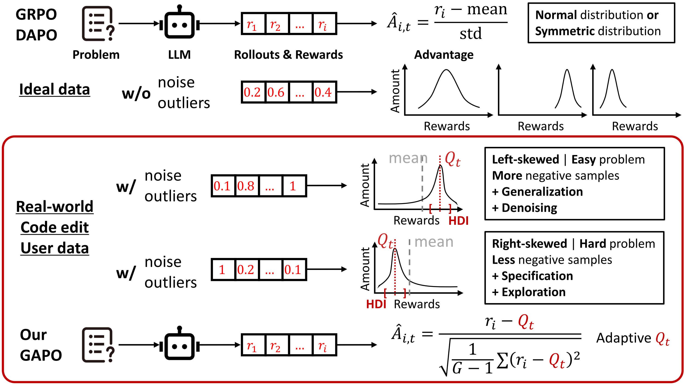

## GAPO: Robust Advantage Estimation for Real-World Code LLMs

[](https://arxiv.org/abs/2510.21830)


TLDR: *Group-Adaptive Advantage Denoiser for GRPO, DAPO, etc.*

Reinforcement learning (RL) is widely used for post-training LLMs in code editing, with group-relative methods like GRPO popular for normalized advantage estimation. However, real-world rewards are often skewed and noisy, causing distorted advantages. We propose Group Adaptive Policy Optimization (GAPO), which selects the highest-SNR interval per prompt and uses its median as an adaptive Q to replace the group mean, reducing noise efficiently.



### How to Use

- We implement GAPO based on [verl](https://github.com/volcengine/verl). Please follow it to create the environment. 

```bash
# Configure MODEL_PATH, CKPTS_DIR, TRAIN_FILE, TEST_FILE in run_grpo.py and run_dapo.py before you run.

python -u run_grpo.py --reward_function edem --model_name Qwen2.5-Coder-7B-Instruct --GPUs 0,1,2,3,4,5,6,7 --rollout_bsz 512 --update_bsz 32 --rollout_n 8 --find_method median --verbose median-div # for grpo

python -u run_dapo.py --reward_function edem --model_name Qwen2.5-Coder-7B-Instruct --GPUs 0,1,2,3,4,5,6,7 --rollout_bsz 512 --update_bsz 32 --rollout_n 8 --find_method median --verbose median-div # for dapo
```